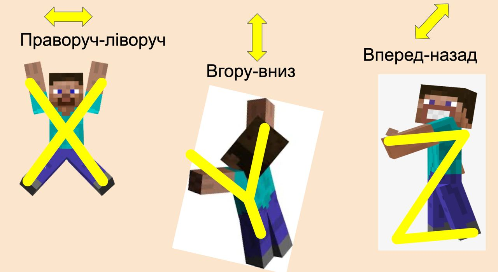
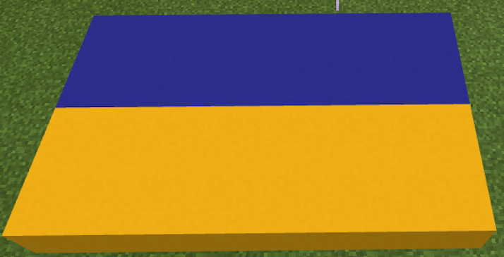
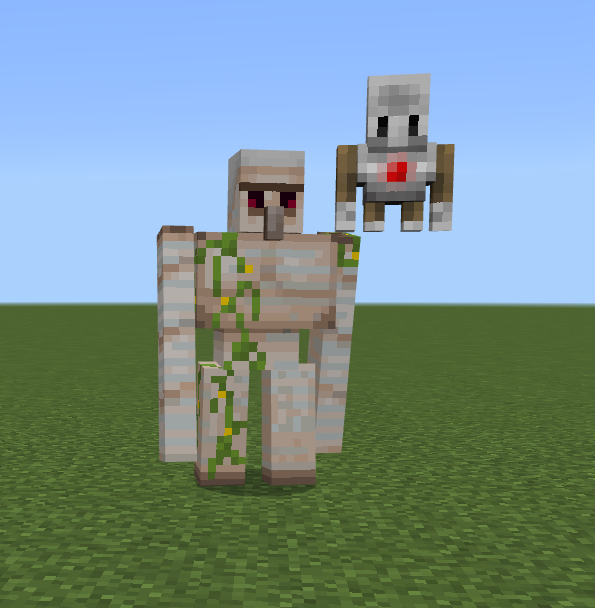

# Подорож до Стародавнього Єгипту

#### Опис


Вирушаймо в подорож Стародавнім світом! Першою зупинкою буде Стародавній Єгипет.&#x20;

Сьогодні ми дізнаємося все про систему координат у Minecraft і навчимося визначати своє місце у просторі за допомогою координат. Навчимося використовувати систему координат та за її допомогою будувати різні елементи відносно гравця. А ще — зробимо футбольне поле у Стародавньому Єгипті!


## Згадаймо🤔

1. Як створити квадрат потрібного розміру?&#x20;
2. Як розрахувати периметр та площу фігури?&#x20;
3. Чи для будь-якої фігури можливо розрахувати площу?

### Сьогодні ми:

1. Дізнаємося про систему координат в Minecraft.&#x20;
2. Навчимося створювати елементи за допомогою відносних координат.&#x20;
3. Самостійно прокладемо лінію з блоків із використанням відносних координат.&#x20;
4. Створимо квадрати та прямокутники з використанням відносних координат.&#x20;
5. Створимо футбольне поле та прапори різних країн.

> **Усі ці навички обов'язково знадобляться під час виконання вашого проєкту!**

### **Теорія**

**Координати** — це сукупність значень, що утворює систему координат, призначену для визначення місця розташування об'єктів в ігровому світі.


**Система координат** — спосіб визначати положення та переміщення точки чи тіла за допомогою чисел або інших символів.


У Minecraft використовується тривимірна система координат, осі якої позначені як X, Y і Z. Осі Z і X відміряють горизонтальні напрямки, Y відміряє вертикальний напрямок (висота).&#x20;

Точка з координатами x=0, z=0, y=0 (точка) є початком відліку, у якому перетинаються три взаємно перпендикулярні осі.

.png>)

Під час створення світу (а також після його створення) в налаштуваннях можна ввімкнути відображення координат:

.png>)

Після увімкнення ми отримаємо відображення координат:

.png>)

Ми бачимо три числа через кому. За замовчуванням гравець перебуває в точці з координатами (0; 4; 0).

Тобто це означає, що гравець перебуває в точці, у якій перша координата (X-координата) і третя координата (Z-координата) дорівнюють нулю. X- і Z-координати демонструватимуть напрямок руху вперед-назад (північ-південь) і вправо-вліво (захід-схід).

.png>)

Кожна вісь має **додатний і від'ємний** напрямок. Додатні напрямки:

* Для осі X — схід
* Для осі Y — верх карти (висота)
* Для осі  Z — південь

Від'ємні напрямки (знак "-" перед числом):

* Для осі X — захід
* Для осі Y — низ карти (глибина)
* Для осі Z — північ

.png>)

### Потренуємося

| Завдання               | Код                                                                                                                                                                                                                                    |
| ---------------------- | -------------------------------------------------------------------------------------------------------------------------------------------------------------------------------------------------------------------------------------- |
| Насипаємо кругом пісок |    |
| Чистимо простір        |   |
| Тільки під ногами      |    |
| Побудуємо стіну        |  |

## **МегаСтрибок**

<figure><figcaption></figcaption></figure>

## Основні завдання


Уявімо, що ми з вами потрапили у Стародавній Єгипет, який славиться своїми пірамідами. Їхнім будівництвом займалися тисячі людей, але завжди будь-яка піраміда починалась із одного блоку. Навчаймося їх будувати, щоб надалі створити власну піраміду!


Minecraft має спеціальну команду «Заповнити блоками», яка дозволяє ставити блоки по координатах. Координати прокладаються за допомогою відносних координат (де мають бути розміщені блоки відносно гравця).

| **Назва**     | **Блоки**                                                                                                                                                                                                                                                                                                                                                                                                                                                              |
| ------------- | ---------------------------------------------------------------------------------------------------------------------------------------------------------------------------------------------------------------------------------------------------------------------------------------------------------------------------------------------------------------------------------------------------------------------------------------------------------------------- |
| **Завдання**  | <ol><li>Прокладіть лінію з <strong>6 блоків піщаника</strong> від координати (~0;~0;~0) до координати (~5;~0;~0)</li><li>Прокладіть лінію з <strong>6 блоків граніту</strong> від координати (~0;~0;~0) до координати (~5;~0;~0)</li><li>Прокладіть лінію з <strong>5 блоків глини</strong> від координати (~0;~0;~1) до координати (~0;~0;~5)</li><li>Прокладіть лінію з <strong>5 блоків цегли</strong> від координати (~0;~0;~1) до координати (~0;~0;~5)</li></ol> |
| **Код**       | .png>)                                                                                                                                                                                                                                                                                                                                                                                                                                  |
| **Результат** | .png>)                                                                                                                                                                                                                                                                                                                                                                                                                                  |

Якщо в команду «Заповнити блоками» вводити координати зі зміною не по одному напрямку, а по двох, то отримаємо прямокутник. Потренуймося!

| **Назва**     | **Блоки**                                                                                                                                                                                                                                                                                                                                                                                                                                                                                                                         |
| ------------- | --------------------------------------------------------------------------------------------------------------------------------------------------------------------------------------------------------------------------------------------------------------------------------------------------------------------------------------------------------------------------------------------------------------------------------------------------------------------------------------------------------------------------------- |
| **Завдання**  | <ol><li>Створіть квадрат <strong>5 x 5</strong> з блоків <strong>піщаника</strong> від координати (~1;~0;~1) до координати (~5;~0;~5)</li><li>Створіть квадрат <strong>4 х 4</strong> з блоків <strong>граніту</strong> від координати (~1;~0;~1) до координати (~4;~0;~4)</li><li>Створіть квадрат <strong>6 х 6</strong> з блоків <strong>глини</strong> від координати (2;~0;~2) до координати (~7;~0;~7)</li><li>Створіть квадрат <strong>7 х 7</strong> з блоків <strong>цегли</strong> (координати оберіть свої).</li></ol> |
| **Код**       | .png>)                                                                                                                                                                                                                                                                                                                                                                                                                                                                                             |
| **Результат** | .png>)                                                                                                                                                                                                                                                                                                                                                                                                                                                                                             |


Якщо ви впорались із усіма основними завданнями, перейдіть до додаткового. Його виконання дозволить вам удосконалити набуті навички!


## Додаткове завдання

### Футбольне поле


Учені вважають, що батьківщиною футболу є Стародавній Єгипет! Факт ігор із м'ячем підтверджується археологічними знахідками у гробницях, збудованих кілька тисячоліть тому. Під час розкопок було знайдено багато м'ячів, набитих папірусом, деревиною пальм та обтягнутих шкірою чи тканиною. Як виявилось, представники цивілізацій, що існували задовго до початку нашої ери, були не лише чудовими воїнами, скотарями та землеробами, а й відмінними спортсменами! Але вони не мали справжнього футбольного поля, відомого нам. Допоможімо давнім єгиптянам пограти у сучасний футбол та зробімо поле!


Спочатку ми зробимо розмітку футбольного поля, а далі розмістимо збоку поля прапори різних країн.

.png>)

### Код для розмітки футбольного поля:

| Частина 1                             | Частина 2                             |
| ------------------------------------- | ------------------------------------- |
| .png>) | .png>)  |
| .png>) | .png>)  |
|                                       | .png>) |

### Прапори


**Прапори в Minecraft** — це кілька різнокольорових прямокутників, які розміщуються поряд.


Для розрахунку координат прапора можна використовувати два способи:

1. Побудувати аналогійний елемент «вручну» та порахувати координати в самому Minecraft.&#x20;
2. Зробити схему майбутніх елементів у електронних таблицях (про них поговоримо докладніше).&#x20;

Координати, вказані після символу, звітують про положення гравця (це називається відносними координатами). Програма відраховує від гравця відстань та ставить блок у відповідне місце.

Перша координата – це координата по осі X (ширина), Y (висота), Z (довжина). На першому етапі ми будемо працювати тільки з X та Z (блоки розміщуватимуться на тій же висоті, на якій знаходиться гравець).

.png>).png>)

Лівий нижній кут синьої частини українського прапора (синього прямокутника) знаходиться у точці (-5; -3), а правий верхній у точці (-4; 3). Відповідно до команди з розміщення блоків ми напишемо, що необхідно заповнити блоками простір від точки (-5; 0; -3) до точки (-4; 0; 3). Аналогійно розраховуються координати жовтої частини прапора.

| **Назва**     | **Линія блоків**                                                                                                              |
| ------------- | ----------------------------------------------------------------------------------------------------------------------------- |
| **Завдання**  | <ol><li>Прапор України</li><li>Прапор Польщі</li><li>Прапор Угорщині</li><li>Прапор Болгарії</li><li>Прапор Австрії</li></ol> |
| **Код**       | 
 
                   |
| **Результат** | 
 
                       |

## Творче завдання

З'єднайте створене футбольне поле та підготовлені прапори:

.png>)

## Супертворче завдання

Поставте прапори на флагштоках.

## [**Ліхтар з використанням координат**](https://makecode.com/\_0LjY9W0tV5pD)

| Завдання  | Розмістіть ліхтарі на вежах з використанням координат                                                                                                                                                                                                                                                                                                                                                                                                                         |
| --------- | ----------------------------------------------------------------------------------------------------------------------------------------------------------------------------------------------------------------------------------------------------------------------------------------------------------------------------------------------------------------------------------------------------------------------------------------------------------------------------- |
| Код       |  |
| Результат |      |

### [Голем](https://makecode.com/\_9jkPW1PE05DU)

|            |                                         |
| ---------- | --------------------------------------- |
| Завдання:  | Використовуючи агента, побудуйте голема |
| Результат: |               |
| Код:       |               |

## Самостійно

1. Напишіть код, щоб було прокладено лінію з **5 блоків** **цегли** від координати (0;0;1) до координати ( 0; 0; 5)&#x20;
2. Напишіть код, щоб було прокладено лінію з **7 блоків ТНТ**
3. Створіть квадрат 4 х 4 з блоків води у землі від координати ( 1; -1;  1) до координати ( 4;  -1; 4)
4. Побудувати підлогу, що світиться (танцпол)
5. Побудова Батут, де Герой при умові “відскок” буде телепортуватися в координати (0,5,0).

### [Можлива відповідь](https://sun-rabbit-493.notion.site/3-d9328af5e2a34b76a64684aa958f8a3d)


Готово! Ви чудові!:tada:


## **Домашнє завдання**

### Завдання 1

Прокладіть лінію з 5 блоків Багаття від координати (\~0;\~0;\~1) до координати (\~0;\~0;\~5)

### Завдання 2

Створіть квадрат 4 х 4 з блоків води у землі від координати (\~1;\~1;\~1) до координати (\~4;\~-1;\~4)

### **Завдання 3 (додатково)** 💃🕺

Побудувати підлогу, що світиться (танцпол)

### Завдання 4 **** (додатково) 🤾🏻‍♀️

Побудова Батут, де Герой при умові «відскок» буде телепортуватися в координати (0,5,0).


На наступному занятті ми продовжимо подорож Стародавнім Єгиптом і побудуємо одне з чудес світу! Ви отримаєте навички, необхідні для вашого проєкту😉

