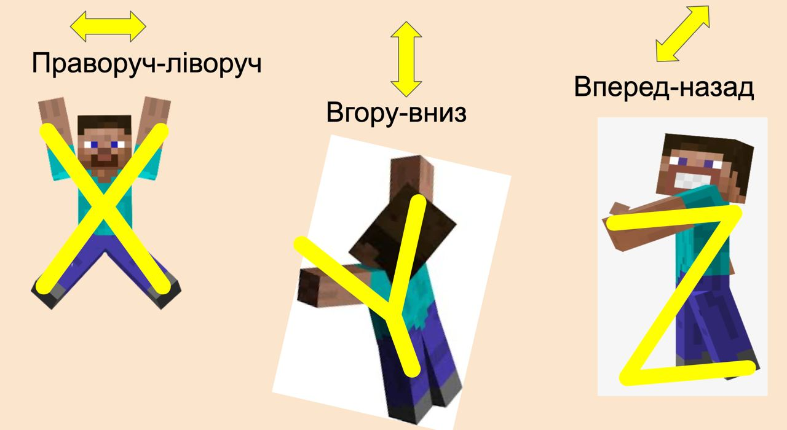
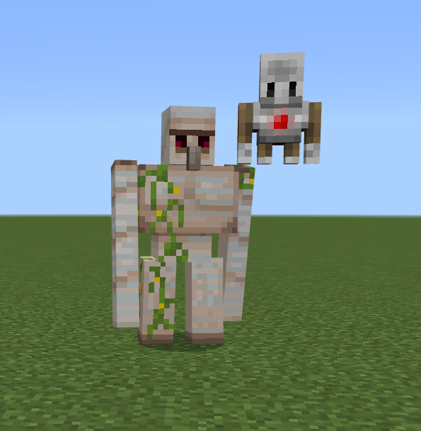
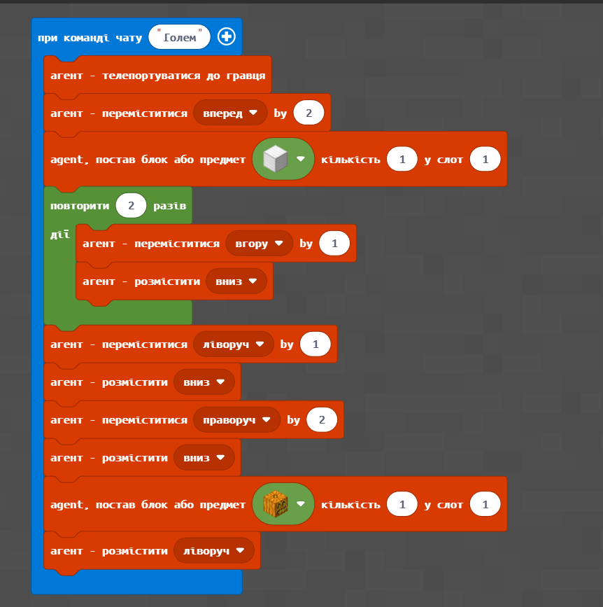

# Viaje al Antiguo Egipto

#### Descripción


¡Embarquémonos en un viaje al mundo antiguo! Nuestra primera parada será en el Antiguo Egipto.&#x20;

Hoy aprenderemos todo sobre el sistema de coordenadas en Minecraft y cómo determinar nuestra ubicación en el espacio utilizando coordenadas. Aprenderemos a utilizar este sistema de coordenadas para construir diferentes elementos en relación al jugador. ¡También construiremos un campo de fútbol en el Antiguo Egipto!


## Recordemos 🤔

1. ¿Cómo crear un cuadrado del tamaño deseado?&#x20;
2. ¿Cómo calcular el perímetro y el área de una figura?
3. ¬øEs posible calcular el √°rea de cualquier figura?

### Hoy haremos lo siguiente:

1. Aprenderemos sobre el sistema de coordenadas en Minecraft.&#x20;
2. Aprenderemos a crear elementos utilizando coordenadas relativas.&#x20;
3. Traceremos una línea de bloques usando coordenadas relativas&#x20;
4. Crearemos cuadrados y rect√°ngulos utilizando coordenadas relativas.&#x20;
5. Crearemos un campo de fútbol y banderas de diferentes países.

> **¬°Todas estas habilidades ser√°n necesarias para llevar a cabo su proyecto!**

### Teoría

Las **coordenadas** son un conjunto de valores que forman un sistema de coordenadas diseñado para determinar la ubicación de objetos en el mundo del juego.


Un **sistema de coordenadas** es una forma de determinar la posición y el movimiento de un punto o un cuerpo mediante números u otros símbolos.


En Minecraft se utiliza un sistema de coordenadas tridimensional, cuyos ejes se denotan como X, Y y Z. Los ejes Z y X miden direcciones horizontales, mientras que Y mide la dirección vertical (altura).&#x20;

El punto con coordenadas x=0, z=0, y=0 (punto) es el punto de referencia donde se cruzan los tres ejes perpendiculares entre sí.

.png>)

Durante la creación del mundo (y también después de su creación), en la configuración se puede habilitar la visualización de coordenadas:

.png>)

Después de habilitarlo, obtendremos la visualización de coordenadas:

.png>)

Vemos tres n√∫meros separados por comas. Por defecto, el jugador se encuentra en el punto con coordenadas (0; 4; 0).

Esto significa que el jugador se encuentra en un punto donde la primera coordenada (coordenada X) y la tercera coordenada (coordenada Z) son igual a cero. Las coordenadas X y Z indicarán la dirección de movimiento hacia adelante y hacia atrás (norte-sur) y hacia la derecha y hacia la izquierda (oeste-este).

.png>)

Cada eje tiene una dirección **positiva y negativa**. Direcciones positivas:

* Para el eje X: este&#x20;
* Para el eje Y: arriba en el mapa (altura)&#x20;
* Para el eje Z: sur

Direcciones negativas (signo "-" antes del n√∫mero):

* Para el eje X: oeste&#x20;
* Para el eje Y: abajo en el mapa (profundidad)&#x20;
* Para el eje Z: norte

.png>)

### Entrenemos

<table><thead><tr><th width="305">Tarea</th><th>Código</th></tr></thead><tbody><tr><td>Echemos arena alrededor</td><td></td></tr><tr><td>Limpiemos el espacio</td><td></td></tr><tr><td>Solo bajo nuestros pies</td><td></td></tr><tr><td>Construyamos un muro</td><td></td></tr></tbody></table>

## **SuperSalto**

<figure><figcaption></figcaption></figure>

## Tareas principales


Imaginemos que hemos viajado juntos al antigua Egipto, conocido por sus pirámides. Miles de personas participaron en su construcción, pero cada pirámide siempre comenzaba con un solo bloque. ¡Aprendamos a construirlos para luego crear nuestra propia pirámide!


Minecraft tiene un comando especial llamado "Llenar con bloques" que permite colocar bloques en coordenadas específicas. Las coordenadas se establecen utilizando coordenadas relativas (donde los bloques se posicionan en relación al jugador).

<table data-header-hidden><thead><tr><th width="183.7386053194607"></th><th width="403"></th></tr></thead><tbody><tr><td><strong>Nombre</strong></td><td><strong>Bloques</strong></td></tr><tr><td><strong>Tareas</strong></td><td><ol><li>Coloca una línea de <strong>6 bloques de arenisca</strong> desde la coordenada (~0;~0;~0) hasta la coordenada (~5;~0;~0) </li><li>Coloca una línea de <strong>6 bloques de granito</strong> desde la coordenada (~0;~0;~0) hasta la coordenada (~5;~0;~0) </li><li>Coloca una línea de <strong>5 bloques de arcilla</strong> desde la coordenada (~0;~0;~1) hasta la coordenada (~0;~0;~5) </li><li>Coloca una línea de <strong>5 bloques de ladrillo</strong> desde la coordenada (~0;~0;~1) hasta la coordenada (~0;~0;~5)</li></ol></td></tr><tr><td><strong>Código</strong></td><td></td></tr><tr><td><strong>Resultado</strong></td><td></td></tr></tbody></table>

Si en el comando "Rellenar con bloques" ingresamos coordenadas en dos direcciones en lugar de una, obtendremos un rect√°ngulo. ¬°Practiquemos!

<table data-header-hidden><thead><tr><th width="183.7386053194607"></th><th width="403"></th></tr></thead><tbody><tr><td><strong>Nombre</strong></td><td><strong>Bloques</strong></td></tr><tr><td><strong>Tareas</strong></td><td><ol><li>Crea un cuadrado de <strong>5 x 5</strong> con bloques de <strong>arenisca</strong> desde la coordenada (~1;~0;~1) hasta la coordenada (~5;~0;~5) </li><li>Crea un cuadrado de <strong>4 x 4</strong> con bloques de <strong>granito</strong> desde la coordenada (~1;~0;~1) hasta la coordenada (~4;~0;~4) </li><li>Crea un cuadrado de <strong>6 x 6</strong> con bloques de <strong>arcilla</strong> desde la coordenada (2;~0;~2) hasta la coordenada (~7;~0;~7) </li><li>Crea un cuadrado de <strong>7 x 7</strong> con bloques de <strong>ladrillo</strong> (elija sus propias coordenadas)</li></ol></td></tr><tr><td><strong>Código</strong></td><td></td></tr><tr><td><strong>Resultado</strong></td><td></td></tr></tbody></table>


Si ha completado todas las tareas principales, pase a la tarea adicional. ¬°Completarla le permitir√° mejorar sus habilidades adquiridas!


## Tarea adicional

### Campo de f√∫tbol


Los científicos creen que la cuna del fútbol es el Antiguo Egipto. El hecho de jugar con una pelota se confirma con hallazgos arqueológicos en tumbas construidas hace miles de años. Durante las excavaciones, se encontraron muchas pelotas hechas de papiro, madera de palma y cubiertas de cuero o tela. Resulta que los representantes de las civilizaciones que existieron mucho antes de nuestra era no solo fueron excelentes guerreros, pastores y agricultores, ¡sino también deportistas excepcionales! Sin embargo, no tenían un campo de fútbol real como lo conocemos. ¡Ayudemos a los antiguos egipcios a jugar al fútbol moderno y construyamos un campo!


Primero haremos la marcación del campo de fútbol, y luego colocaremos banderas de diferentes países en un lado del campo.

.png>)

### Código para marcar un campo de fútbol:

<table><thead><tr><th width="376.3333333333333">Parte 1</th><th width="379">Parte 2</th></tr></thead><tbody><tr><td></td><td></td></tr><tr><td></td><td></td></tr><tr><td></td><td></td></tr></tbody></table>

### Banderas


Las **banderas en Minecraft** son varios rect√°ngulos de diferentes colores que se colocan juntos.


Para calcular las coordenadas de la bandera, puedes usar dos métodos:

1. Construir un elemento similar manualmente y calcular las coordenadas en el propio Minecraft.&#x20;
2. Crear un esquema de los futuros elementos en hojas de cálculo electrónicas (hablaremos más detalladamente sobre esto).&#x20;

Las coordenadas que se indican después del símbolo representan la posición del jugador (esto se llama coordenadas relativas). El programa calcula la distancia desde el jugador y coloca el bloque en el lugar correspondiente.&#x20;

La primera coordenada es la coordenada en el eje X (ancho), Y (altura), Z (longitud). En la primera etapa, trabajaremos solo con X y Z (los bloques se colocar√°n a la misma altura en la que se encuentra el jugador).

.png>).png>)

El rincón inferior izquierdo de la parte azul de la bandera ucraniana (el rectángulo azul) se encuentra en el punto (-5; -3), y el rincón superior derecho en el punto (-4; 3). Según las instrucciones para colocar bloques, escribiremos que es necesario llenar el espacio con bloques desde el punto (-5; 0; -3) hasta el punto (-4; 0; 3). Las coordenadas de la parte amarilla de la bandera se calculan de manera similar.

<table data-header-hidden><thead><tr><th width="194.21971252566738"></th><th width="387.3808951771049"></th></tr></thead><tbody><tr><td><strong>Nombre</strong></td><td><strong>Línea de bloques</strong></td></tr><tr><td><strong>Tareas</strong></td><td><ol><li>Bandera de Ucrania </li><li>Bandera de Polonia </li><li>Bandera de Hungría </li><li>Bandera de Bulgaria </li><li>Bandera de Austria</li></ol></td></tr><tr><td><strong>Código</strong></td><td> </td></tr><tr><td><strong>Resultados</strong></td><td> </td></tr></tbody></table>

## Tarea creativa

Conecte el campo de f√∫tbol creado con las banderas preparadas:

.png>)

## Tarea s√∫per creativa

Coloque banderas en los m√°stiles.

## [**Faroles usando coordenadas**](https://makecode.com/\_0LjY9W0tV5pD)

<table data-header-hidden><thead><tr><th width="192"></th><th></th></tr></thead><tbody><tr><td>Tarea</td><td>Coloque los faroles en las torres utilizando las coordenadas</td></tr><tr><td>Código</td><td></td></tr><tr><td>Resultado</td><td></td></tr></tbody></table>

### [Gólem](https://makecode.com/\_9jkPW1PE05DU)

<table><thead><tr><th width="201"></th><th></th></tr></thead><tbody><tr><td>Tarea:</td><td>Usando el agente, construya un gólem.</td></tr><tr><td>Resultado:</td><td> </td></tr><tr><td>Código:</td><td></td></tr></tbody></table>

## Trabajo individual

1. Escribir el código para colocar una línea de **5 bloques de ladrillo** desde la coordenada (\~0;\~0;\~1) hasta la coordenada (\~0;\~0;\~5)
2. Escribir el código para colocar una línea de 7 **bloques de TNT**

### [Posible respuesta](https://sun-rabbit-493.notion.site/3-d9328af5e2a34b76a64684aa958f8a3d)


¬°Listo! ¬°Son los mejores!:tada:


## **Tarea**

### Tarea 1

Coloque una línea de 5 bloques de Hoguera desde la coordenada (\~0;\~0;\~1) hasta la coordenada (\~0;\~0;\~5)

### Tarea 2

Cree un cuadrado de 4x4 con bloques de agua en la tierra desde la coordenada (\~1;\~1;\~1) hasta la coordenada (\~4~~;~~\~1;\~4)

### Tarea **3 (**adicional**)** 💃🕺

Construya una pista de baile iluminada (pista de baile)

### Tarea 4 (adicional) 🤾🏻‍♀️

Construya un trampolín, donde el Héroe, en caso de un "rebote", será teletransportado a las coordenadas (0,5,0)


En la próxima clase, continuaremos nuestro viaje por el Antiguo Egipto y construiremos una de las maravillas del mundo. Obtendra las habilidades necesarias para tu proyecto 😉

